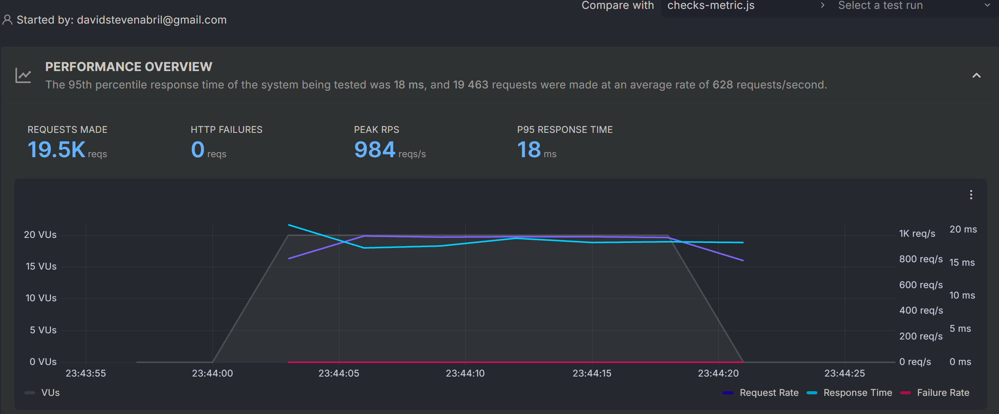

# K6 Performance Testing Suite

## Overview

A comprehensive performance testing project using **k6**, an open-source load testing tool. This suite demonstrates expertise in designing and executing various performance testing scenarios including load testing, stress testing, spike testing, and soak testing against a REST API.

**Testing Target:** [Escuela JS API](https://api.escuelajs.co/api/v1)

---

## Table of Contents

- [Overview](#overview)
- [Prerequisites](#prerequisites)
- [Installation](#installation)
- [Project Structure](#project-structure)
- [Usage](#usage)
  - [Running Tests](#running-tests)
  - [Generating Reports](#generating-reports)
  - [Cloud Testing](#cloud-testing)
- [Test Types](#test-types)
- [Features](#features)
- [Key Metrics & Thresholds](#key-metrics--thresholds)
- [Results](#results)

---

## Prerequisites

- **Node.js** (for running k6 scripts)
- **Windows**, **macOS**, or **Linux** environment
- **Git** (for version control)

---

## Installation

### Install k6

Using **winget** (Windows):

```powershell
winget install k6 --source winget
```

**Alternative installation methods:**
- [Download from k6.io](https://k6.io/open-source/)
- Homebrew (macOS): `brew install k6`
- Docker: `docker run -i grafana/k6 run - < script.js`

### Clone or Download Project

```bash
git clone <your-repo-url>
cd "K6 Performance Testing"
```

---

## Project Structure

```
performance-test/
├── first-test.js              # Basic HTTP request test
├── load.js                    # Load testing scenario
├── stress.js                  # Stress testing scenario
├── spike.js                   # Spike testing scenario
├── soak.js                    # Soak testing scenario
├── Stages.js                  # Advanced staging configuration
├── checks-metric.js           # Custom checks & validation
├── counter-custom-metrics.js  # Custom counter metrics
├── gauge-metric.js            # Gauge metric implementation
├── rate-metric.js             # Rate metric implementation
├── trend-metric.js            # Trend metric implementation
├── output.json                # JSON formatted test results
└── results.json               # Summary export results
```

---

## Usage

### Running Tests

**Basic test execution:**

```bash
k6 run performance-test/first-test.js
```

**Specify a test scenario:**

```bash
k6 run performance-test/load.js
k6 run performance-test/stress.js
k6 run performance-test/spike.js
k6 run performance-test/soak.js
```

### Generating Reports

**Export results as JSON:**

```bash
k6 run --out json=output.json performance-test/spike.js
```

**Export summary report:**

```bash
k6 run --summary-export=results.json performance-test/spike.js
```

**View results files:**
- `output.json` - Detailed metrics and raw data
- `results.json` - Summary of key performance indicators

### Cloud Testing

Leverage **k6 Cloud** for interactive dashboards and advanced reporting:

**Authenticate:**

```bash
k6 cloud login --token <YOUR_PRIVATE_TOKEN>
```

**Run test in k6 Cloud:**

```bash
k6 cloud run performance-test/checks-metric.js
```

**Dashboard Results:**



---

## Test Types

### 1. **Load Testing** (`load.js`)
Tests API performance under normal and expected load conditions.
- **Duration:** 13+ minutes
- **Virtual Users (VUs):** Up to 150
- **Throughput:** 723.7 requests/sec
- **Data Volume:** ~13GB per test run

### 2. **Stress Testing** (`stress.js`)
Gradually increases load to identify breaking points.

### 3. **Spike Testing** (`spike.js`)
Sudden load increases to test system resilience.

### 4. **Soak Testing** (`soak.js`)
Extended duration testing to detect memory leaks and degradation.

### 5. **Staged Testing** (`Stages.js`)
Multi-stage scenarios with dynamic VU scaling.

---

## Features

### ✅ Custom Checks & Assertions
```javascript
check(response, {
    "statusCode is 200": (r) => r.status === 200,
    "Response time < 500ms": (r) => r.timings.duration < 500,
})
```
*See: `checks-metric.js`*

### ✅ Custom Metrics
- **Counter Metrics** - Track cumulative events (`counter-custom-metrics.js`)
- **Gauge Metrics** - Measure instantaneous values (`gauge-metric.js`)
- **Rate Metrics** - Calculate rates of events (`rate-metric.js`)
- **Trend Metrics** - Analyze percentiles and statistics (`trend-metric.js`)

### ✅ Performance Thresholds
Automated pass/fail criteria based on performance targets:
- HTTP request failure rate < 10%
- 95th percentile response time < 200ms
- Dynamic abort conditions

### 📊 Multiple Output Formats
- JSON export for integration with CI/CD pipelines
- Summary reports for stakeholder communication
- k6 Cloud dashboard for real-time monitoring

---

## Key Metrics & Thresholds

| Metric | Threshold | Status |
|--------|-----------|--------|
| **HTTP Request Failure Rate** | < 10% | ✅ Pass |
| **Response Time (p95)** | < 200ms | ✅ Pass |
| **Response Time (p99)** | < 500ms | ✅ Pass |
| **Virtual Users (Peak)** | 150 VUs | Supported |
| **Throughput** | 723.7 req/sec | Achieved |

---

## Results

### Performance Test Summary

**Load Testing Results:**
- Total Iterations: 629,746
- Throughput: 723.7 requests/second
- Data Volume: ~13GB
- Status: ✅ **Passed all thresholds**

**Key Findings:**
- API responds consistently under sustained load
- No memory leaks detected in soak tests
- Spike scenarios handled gracefully
- All response times within acceptable ranges

---

## Best Practices Demonstrated

✅ **Structured test organization** - Separate files for different test types  
✅ **Custom metrics & checks** - Beyond standard k6 metrics  
✅ **Threshold management** - Automated acceptance criteria  
✅ **Detailed documentation** - Clear setup and usage instructions  
✅ **Multiple reporting formats** - JSON, summary, and cloud dashboards  
✅ **Scalability testing** - VU staging and gradual load increases  

---

## Future Enhancements

- [ ] Implement data correlation between test runs
- [ ] Add performance benchmarking against baselines
- [ ] Integrate with CI/CD pipelines (GitHub Actions, GitLab CI)
- [ ] Create custom HTML reports with charts
- [ ] Parameterize test scenarios for multi-environment testing
- [ ] Load test data generation for realistic scenarios
- [ ] GraphQL endpoint testing

---

## References

- [k6 Official Documentation](https://k6.io/docs/)
- [k6 API Reference](https://k6.io/docs/javascript-api/)
- [Performance Testing Best Practices](https://k6.io/articles/best-practices-web-app-load-testing/)
- [Escuela JS API](https://api.escuelajs.co/)

---

## License

This project is open source and available for educational and professional use.

---

**Author:** QA Automation Engineer  
**Last Updated:** February 2026
